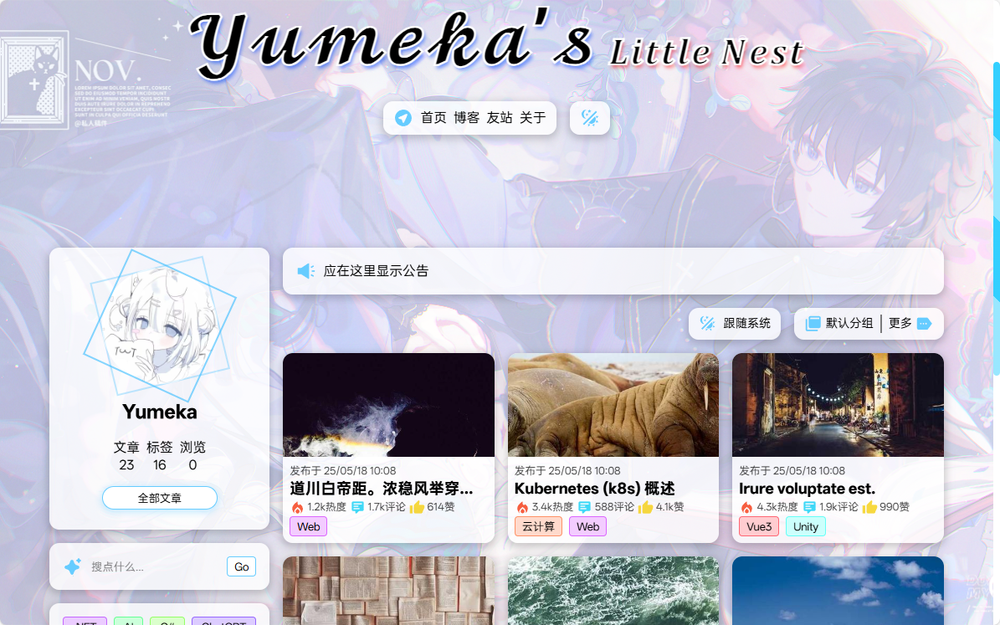
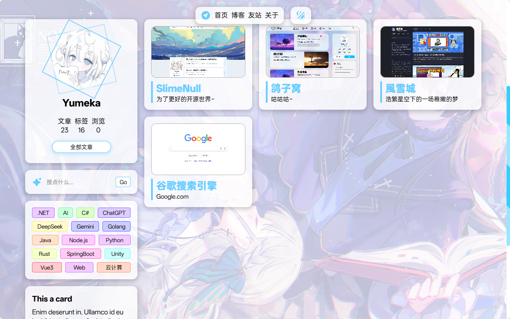

# Yumeka の 小窝 🍃

轻量级个人博客, 持续进化中~ ✨

> 此仓库为 v2 版本, v1 前往 [YumekaBlog.Old](https://github.com/miniyu157/YumekaBlog.Old)

## 项目使用

- 客户端: Vue3
- 服务端: Node.js Express
- 数据库: MongoDB

## 预览 📸

